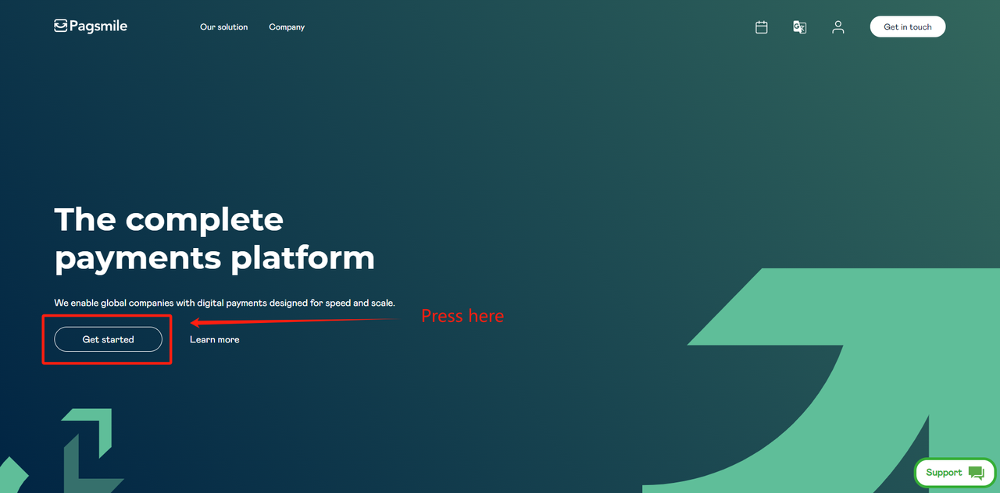
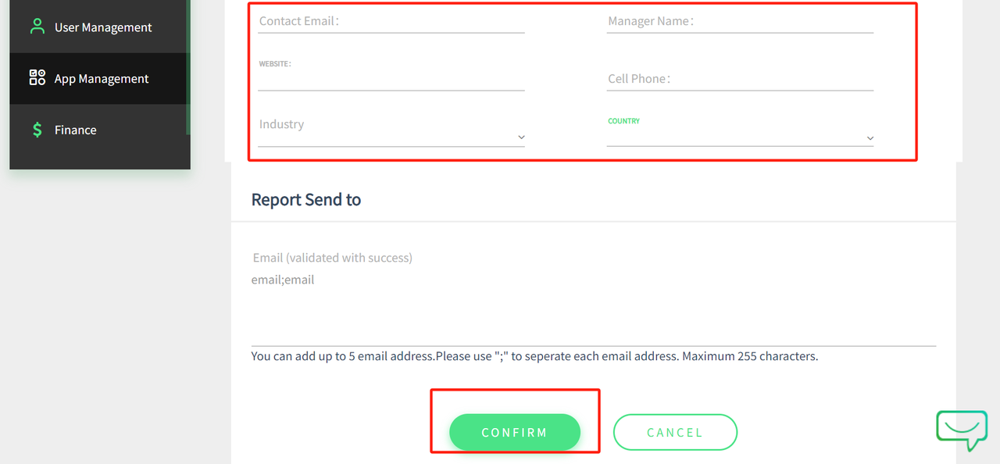
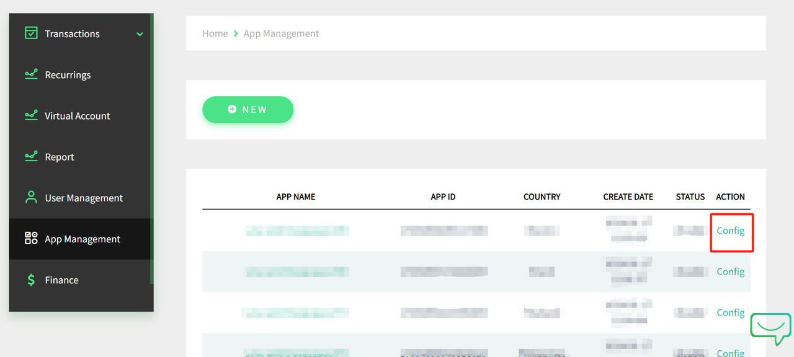
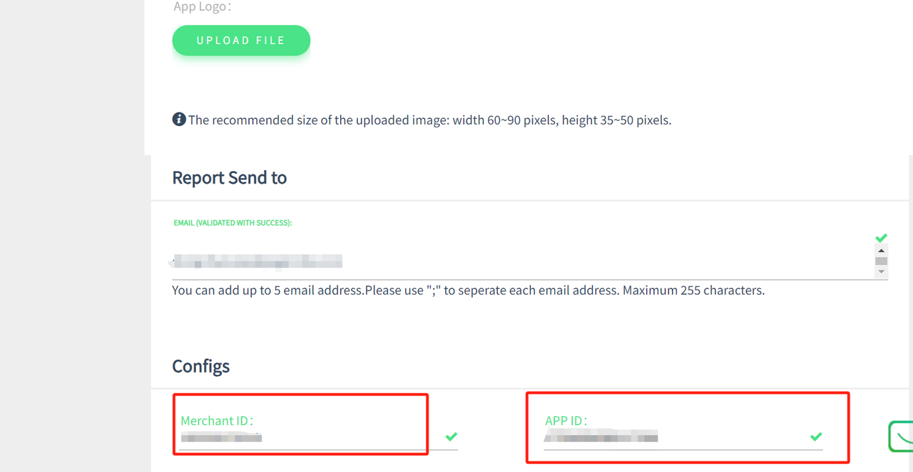

# E-com Platform

## **Introduction**

Pagsmile is a global platform facilitating various payment methods tailored to the country you are selling to. Utilize Pagsmile plugins for integration with any of our [supported platforms](support-platform.md) during customer checkout. Alternatively, you can create your integration by following our API documentation. Before initiating the process, to become a partner, please contact our business team to gain access to our dashboards through the [Pagsmile official website](https://pagsmile.com/).

<figure><figcaption></figcaption></figure>

<figure><figcaption></figcaption></figure>

After you submit information about your company, the Pagsmile business team will contact you. Depending on the case, there would be an additional onboarding process and after the credentials are provided, access to the backend will be given.

## Get an Account & Apply for APP\_ID

Once you become Pagsmile's partner, the next step will be to start using our payment methods by getting an APP\_ID & SECRET\_KEY through the Merchant dashboard. The link to the dashboard should be obtained through Pagsmile's business team.

<figure><figcaption>
Login into Pagsmile's Merchant Dashboard and create an App
</figcaption></figure>

<figure><figcaption>
Fill in the required information to create the app
</figcaption></figure>

<figure><figcaption>
After creating the app, click Config to view keys
</figcaption></figure>

<figure><figcaption>
Get Merchant ID, App ID, and Security Key
</figcaption></figure>

