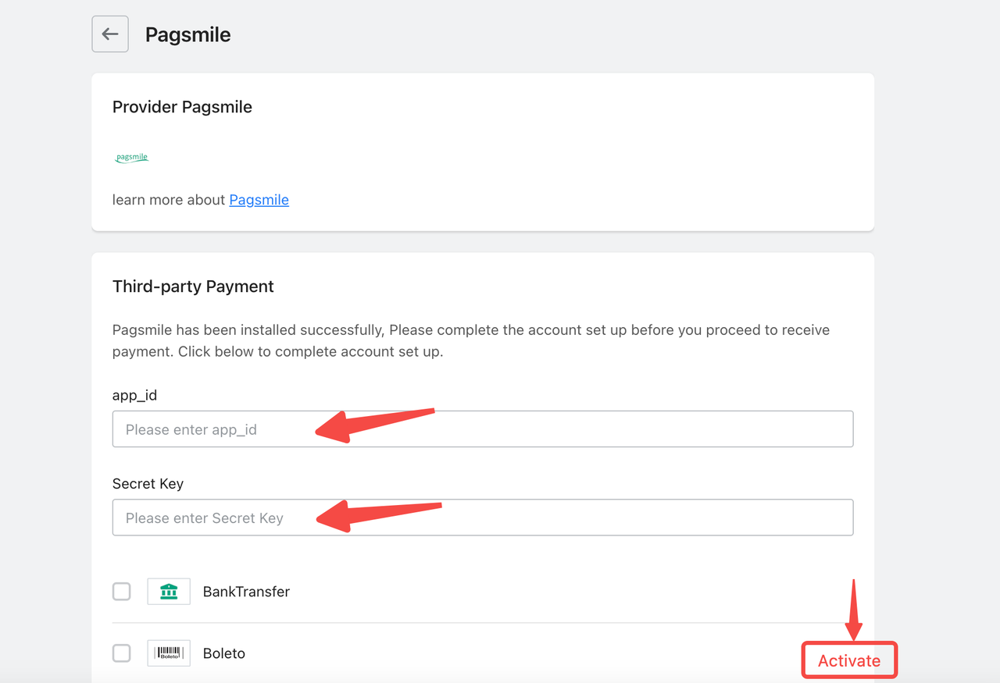

# Shoplazza

1. Login into Shoplazza and choose your partner account.

<figure><figcaption>
Login into Shoplazza and choose your partner account
</figcaption></figure>

2. Go to the Stores section and choose your store.

<figure><figcaption>
Go to the Stores section and choose your store
</figcaption></figure>

3. Go to the "Settings" section - "Payments", then press the "Add payment provider" button.

<figure><figcaption>
Go the the "Settings" section - "Payments", then press the "Add payment provider" button
</figcaption></figure>

4. Once you get into the payment provider search page, please choose the "Search by payment provider" menu, type in "Pagsmile" into the search module, and press "Enter". Afterward, you will be able to find an official Pagsmile plugin in the search list. Press the "Activate" button.

<figure><figcaption>
Choose "Search by payment provider" menu, fill in info and submit
</figcaption></figure>

5. After pressing the "Activate" button you will be redirected to Pagsmile plugin details page, where you will be able to install the plugin by pressing on "Install" button. Continue with the installation process.

<figure><figcaption>
Click "Install" button
</figcaption></figure>

6. After the Pagsmile plugin is installed, there will be a popup where the App ID and App Key should be provided.

<figure><figcaption>
Fill in App Id and Security Key
</figcaption></figure>

7. Press "Submit" button

<figure><figcaption></figcaption></figure>

8. That’s all, you've successfully integrated Pagsmile payment into your Shoplazza store. Now you will be able to process transactions using Pagsmile payment.

