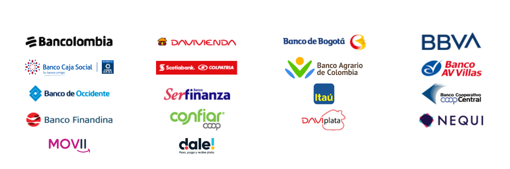

# Transfiya



This endpoint allows you to submit a payout by Transfiya in Colombia.



application/json; charset=UTF-8



Your App ID in payout platform



SHA256($sorted\_params + $app\_key)



Beneficiary's name, length must between 5 and 100



Beneficiary's phone

\- 0 \~ 15 digits -



Beneficiary's email



Beneficiary document id



Beneficiary [_**document type**_](transfiya.md#account-type), should be one of CC, CE, PEP



Beneficiary's account

\- 12 \~ 14 digits -



Fixed Value: PHONE



Fixed Value: Transfiya



Merchant's order id

\- Max.50 -



One of \[beneficiary | merchant]



Payout amount, should be an Integer.

\- Min 1,000, Max 10,000,000 COP per transaction -



Specify the amount value is fixed for merchant or beneficiary\
\- One of: source\_amount, arrival\_amount(default) -



Merchant's account currency

\-  supported: USD, GBP, EUR, COP -



Beneficiary's account currency.

\- Fixed Value: COP -



Where pagsmile will callback to



Additional Remark\
\- Max Length: 40 -&#x20;



Fixed value: COL, for Colombia



```
{
    "code": 200,
    "msg": "success",
    "time": 1628580845,
    "data": {
        "id": "TS202108100734054iRiUZFPXfQBC",
        "custom_code": "custom_code9982674851738108",
        "arrival_amount": "100",
        "arrival_currency": "COL",
        "source_amount": "0.07",
        "source_currency": "USD",
        "status": "IN_PROCESSING"
    }
}
```



```
{
    "code": 4001000,
    "msg": "invalid parameter",
    "time": 1637224716,
    "data": {
        "err": "error detail message"
    }
}
```



```
{
    "code": 4004003,
    "msg": "permission denied",
    "time": 1637224716,
    "data": {
        ... ...
    }
}
```



```
{
    "code": 5001003,
    "msg": "fee not configured",
    "time": 1637224716,
    "data": {
        ... ...
    }
}
```



```
{
    "code": 5001102,
    "msg": "balance insufficient",
    "time": 1637224716,
    "data": {
        ... ...
    }
}
```



```
{
    "code": 5001000,
    "msg": "system error",
    "time": 1637224716,
    "data": {
        "err": "error detail message"
    }
}
```



## Example

```
curl --location --request POST 'https://sandbox.transfersmile.com/api/payout' \
--header 'AppId: 94FAC**********************68548' \
--header 'Authorization: d6181db0d6548b94b162e75d095b59147172d914699f83b2bd17951a671b6302' \
--header 'Content-Type: application/json' \
--data-raw '{
    * "name" : "GUILHERME ****** SOUZA",
      "phone" : "468****068", 
      "email" : "g******me@gmail.com", 
    * "account" : "57012345678910", // just for test in sandbox
    * "account_type" : "PHONE",
    * "document_id" : "123456789", // just for test in sandbox, don't use this in production.
    * "document_type" : "CC",
    * "method" : "Transfiya",
    * "custom_code" : "your_order_id", // merchant order id
    * "fee_bear" : "merchant",
    * "amount" : "100", //Amount should be an integer, like 1.00 is not available.
    * "source_currency" : "COP",
    * "arrival_currency" : "COP",
    * "notify_url" : "https://notify.url",
    * "additional_remark" : "pagsmile payout test",
    * "country": "COL"
}'
```


Note:  _**94FAC\*\*\*\*\*\*\*\*\*\*\*\*\*\*\*\*\*\*\*\*\*\*68548**_ is Pagsmile's test App ID for sandbox, and _**d6181db0d6548b94b162e75d095b59147172d914699f83b2bd17951a671b6302**_ is authorization token associated with the test App ID.


## Document Type

| Name | Length          | Type       |
| ---- | --------------- | ---------- |
| CC   | Between 6 to 10 | numeric    |
| CE   | up to 12        | characters |
| PEP  | up to 15        | numeric    |

## Example of Account

| Account Type | Account        | Description                   |
| ------------ | -------------- | ----------------------------- |
| PHONE        | 57012345678910 | numeric, always start with 57 |

## Supported Banks and Wallets

Bancolombia, DAVIVIENDA, Banco de Bogotá, Banco Caja Social, Banco AV Villas, Banco Ser finanza, Itau, Banco Cooperativo Coop Central, Banco Finandina, confiar coop, DAVIplata, NEQUI, MOVII, dale!

<figure><figcaption></figcaption></figure>

